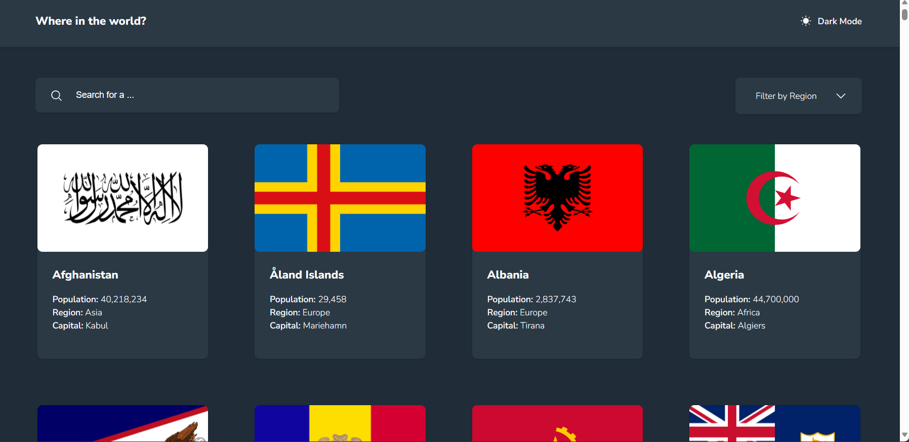
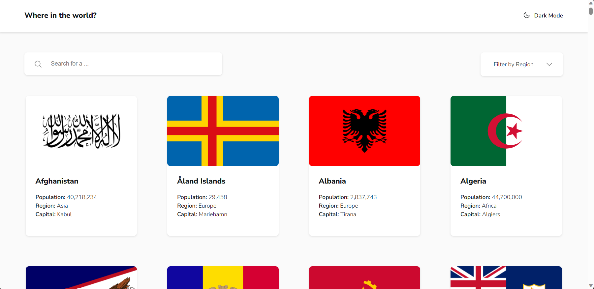
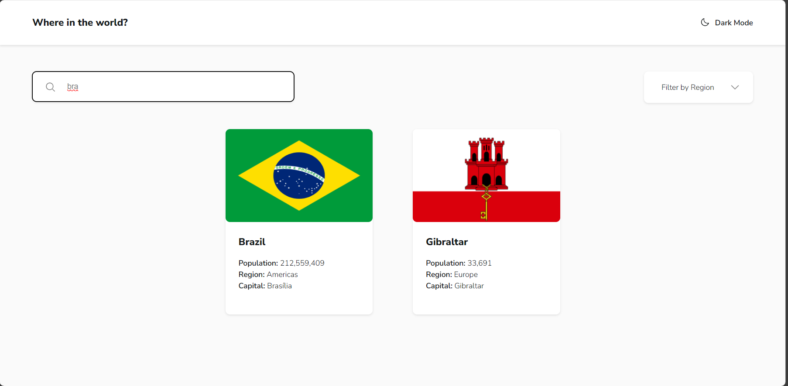
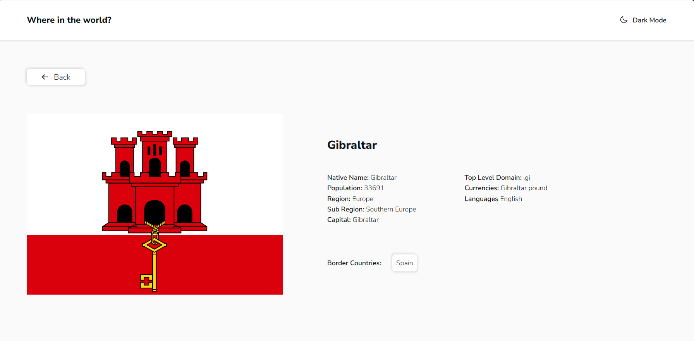

Frontend Mentor - REST Countries API with color theme switcher solution

This is a solution to the [REST Countries API with color theme switcher challenge on Frontend Mentor](https://www.frontendmentor.io/challenges/rest-countries-api-with-color-theme-switcher-5cacc469fec04111f7b848ca). Frontend Mentor challenges help you improve your coding skills by building realistic projects.

## Table of contents

- [Overview](#overview)

- [The challenge](#the-challenge)

- [Screenshot](#screenshot)

- [Links](#links)

- [My process](#my-process)

- [Built with](#built-with)

- [What I learned](#what-i-learned)

- [Continued development](#continued-development)

- [Author](#author)

## Overview

### Available Scripts

    git clone https://github.com/jacque-sbraga/countries-of-the-world

    npm i

    npm start

Runs the app in the development mode.
Open [http://localhost:3000](http://localhost:3000) to view it in your browser.

### The challenge

Users should be able to:

- See all countries from the API on the homepage
- Search for a country using an `input` field
- Filter countries by region
- Click on a country to see more detailed information on a separate page
- Click through to the border countries on the detail page
- Toggle the color scheme between light and dark mode *(optional)*

### Screenshot

### Links

- Solution URL: [jacque-sbraga/countries-of-the-world (github.com)](https://github.com/jacque-sbraga/countries-of-the-world)

- Live Site URL: [Add live site URL here](https://your-live-site-url.com)

## My process

### Built with

- React
- Styled Components
- Redux
- Axios

### What I learned

 - **Redux Usage:** I learned to use Redux to create global states in my application. It allowed me to easily share data between components and maintain a more organized control of the application's state.

- **API Integration:** I found out how to make API requests using Axios, which provided me with an effective way to fetch and display external data in my application.

- **Componentization in React:** I learned to break down my user interface into smaller components, making the structure of my application more organized and easy to maintain.

- **React Routing:** By creating a separate page to display detailed information about a country and enabling navigation between neighboring countries, I learned to use React's routing capabilities, making my application more dynamic and navigable.

- **Styling with Styled Components:** I used Styled Components to style my components in a more modular and efficient manner. It allowed me to create styles in a more cohesive and easy-to-maintain way.

- **Color Scheme Toggle:** I learned how to implement a color scheme toggle between light and dark mode in my application, adding an extra layer of customization for users.

### Continued development

 -  **Advanced Redux Patterns:** While I've learned the basics of Redux, I want to delve deeper into advanced patterns and best practices. This includes optimizing state management, using middleware effectively, and exploring libraries like Redux Thunk or Redux Saga for more complex asynchronous actions.

-  **Performance Optimization:** I'd like to enhance my skills in optimizing the performance of React applications. This involves learning more about techniques like code splitting, lazy loading, and memoization to ensure that my apps are as efficient as possible.

- **Testing:** Testing is a crucial aspect of modern front-end development. I want to become more proficient in writing unit tests, integration tests, and end-to-end tests using tools like Jest and Cypress to ensure the reliability and robustness of my applications.

-  **Accessibility:** Making web applications accessible to all users is a top priority. I plan to improve my understanding of web accessibility standards (WCAG) and practice implementing accessible designs and features from the outset of my projects.

- **Server-Side Rendering (SSR) and SEO:** To enhance the search engine optimization (SEO) of my applications, I aim to explore server-side rendering in React, which can improve initial load times and SEO rankings.

-  **State Management Alternatives:** While Redux is powerful, there are other state management libraries like Mobx and Recoil. I want to explore these alternatives to understand their strengths and weaknesses and choose the best tool for each project.

## Author

- Frontend Mentor - [@jacque-sbraga](https://www.frontendmentor.io/profile/jacque-sbraga)
- Github - [jacque-sbraga (Jacqueline Braga) (github.com)](https://github.com/jacque-sbraga)

